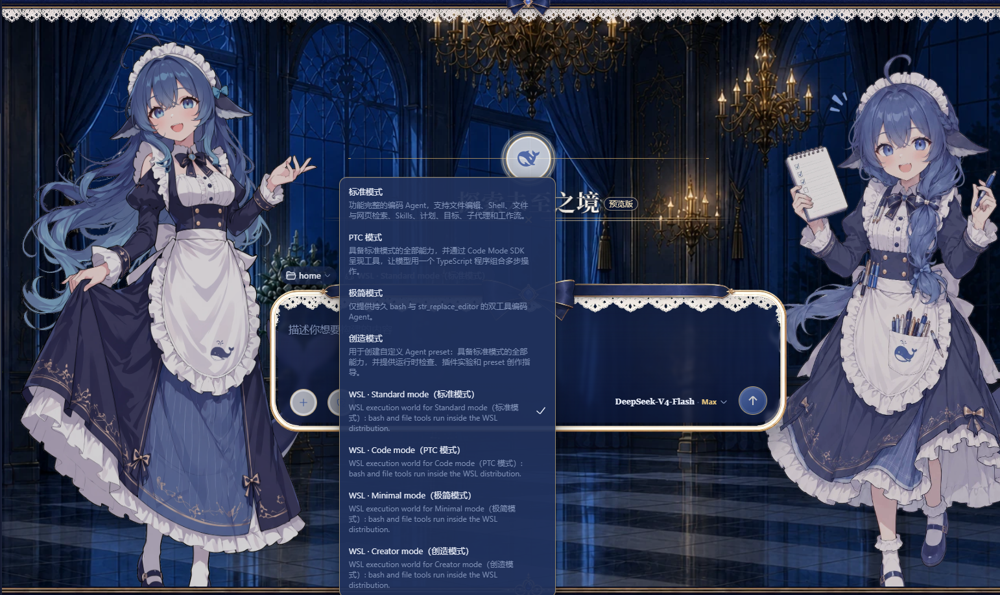
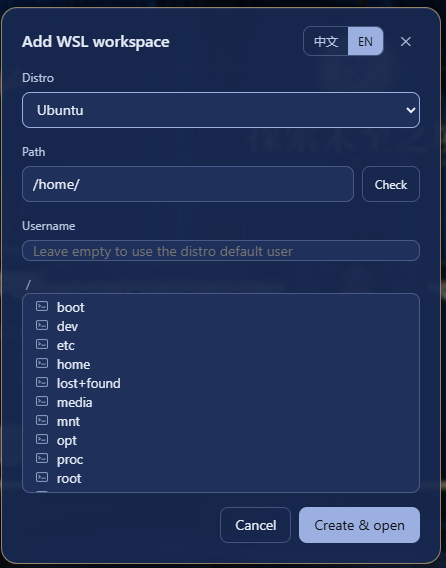

# @dsh-selfuse/wsl-workspace

[English](README.md) | 中文

## 概述

这个旧 bundle 曾把 Web 工作区映射到 WSL 发行版，并将 shell 和文件操作路由至其中。selfuse 运行态迁移到原生 WSL 期间，本包仅为历史会话兼容而保留。未核对活跃 profile 与迁移状态之前，不应为新会话启用。

## 目录

- 安装
- 使用
- 行为与权限说明
- 许可与出处
- 模型体验
- 已知限制与待办
- 开发备注

 在 DeepSeek Harness Web GUI 中「添加 WSL 工作区」：让 agent 会话的 bash 命令与文件读写都运行在本机 WSL 发行版里，路径均为 Linux 形式，WSL 内无需安装任何工具链。会话可同时访问 WSL 与 Windows 两个系统——bash 命令在 WSL 发行版内执行，Windows 文件随时可通过 `/mnt/<drive>`（如 `/mnt/c/Users/...`）访问。

## 安装

三种方式任选其一，然后重启 `dsh web`：

```powershell
# 1) npm package
dsh plugin --profile web add @dsh-selfuse/wsl-workspace

# 2) GitHub repository (ships the prebuilt lib/, no local build required)
dsh plugin --profile web add https://github.com/6Mikao9/@dsh-selfuse/wsl-workspace

# 3) Local directory (development / self-hosted)
dsh plugin --profile web add D:\path\to\@dsh-selfuse/wsl-workspace
```

重启 `dsh web` 后，侧栏底部 Settings 旁出现 W 按钮。

## 使用

点侧栏底部 Settings 旁的 W 按钮，打开「添加 WSL 工作区」对话框。先从下拉框选择一个发行版，再浏览目录树或直接输入 Linux 绝对路径（如 `/home/me/proj`），可以点「检查」确认路径存在。对话框文案跟随 DSH 界面语言。用户名是可选项：留空则以该发行版的默认用户运行，填写该发行版里的某个 Linux 用户名则以该用户运行（等价于 `wsl.exe -u <用户名>`）。用户名只改变 bash 工具的运行身份；文件工具使用运行 DSH 宿主的账户。每个工作区填写的用户名保存在 `<dshHome>/wsl-workspaces.json`，删除对应条目（或重开对话框重建工作区）即可恢复默认用户。

点「创建并打开」后，新会话随即运行在 WSL：`bash` 工具在所选发行版内执行命令，`read`/`write`/`edit` 读写 WSL 文件，模型看到的所有路径都是 Linux 形式。模式选择器照常可用——标准、PTC、极简、创造都会自动落到对应的 WSL 变体（选择器里的 WSL 变体条目为中英双语，如 `WSL · Standard mode（标准模式）`）；会话内仍可通过 `/mnt/<drive>`（如 `/mnt/c/Users/...`）访问 Windows 文件。 
## 行为与权限说明

- **bash 工具**：以配置的用户名在 WSL 发行版内运行（留空 = 发行版默认用户，通常为 root），可对发行版内任意路径读写。Windows 的 ACL 沙箱无法包裹 `wsl.exe`（子进程运行在 Linux 内核侧），WSL 自身即隔离边界，DSH 文件策略不作用于 bash。
- **文件工具（read/write/edit/str_replace_editor）**：DSH 运行在 Windows 时经 WSL 9P 共享访问；运行在 WSL 内时直接使用 Linux 路径。工具使用 DSH 宿主账户，并受 DSH 文件策略约束。`workspace-write` 下读可到任意位置、写仅限会话工作区；改为 `danger-full-access` 后工作区外也可写入。两种宿主均应使用 `/mnt/f/LaTeX` 这样的 Linux 路径；WSL 宿主的文件后端也接受 Windows 盘符路径，并将其规范化为 `/mnt/<drive>`。运行在 Linux 的 DSH 只接受属于本机 `WSL_DISTRO_NAME` 的 UNC 路径；其他发行版会被明确拒绝，不会被悄悄转向。
- `wsl.exe` 在发行版尚未启动时向 stderr 打印的 localhost 端口转发提示（乱码但无害）可忽略。

## 许可与出处

MIT，详见 [LICENSE](LICENSE) 与 [NOTICE](NOTICE)，NOTICE 精确列明：

- **改编/继承源码**：DeepSeek Harness（MIT）的 `dsh-bash-local`（执行器机制）、`dsh-fs-local`（`WslFileSystem` 子类化）、shipped agent presets（变体生成读取/变换）；
- **设计参考（未复制源码）**：[dsh-bash-terminal](https://github.com/MAXeaglet/dsh-bash-terminal)（MIT，wsl argv/WSLENV 思路）、[dsh-side-panel](https://github.com/ccq1/dsh-side-panel)（BSD-3-Clause，Host 路由模式）、[vpshub](https://github.com/Sdongmaker/vpshub)（MIT，路线图参考）。

发布/再分发时请保留 LICENSE 与 NOTICE。

## 致谢

特别感谢 [dsh-deep-whale](https://github.com/Small-tailqwq/dsh-deep-whale)（DSH Web 鲸鱼娘皮肤系列 · 深海女仆工坊 maid-atelier，CC BY-NC-SA 4.0）：鲸鱼娘皮肤插件为 DeepSeek Harness Web 界面带来了一整套可爱的皮肤，让 DSH 的日常使用更有温度。

## 模型体验

模型通过现有 shell 与文件工具间接看到 WSL 路径和操作结果。

#### KV Cache 影响

改变工作区 provider 本身不会增加模型文本；后续工具调用可按常规把结果加入当前轮上下文。

## 已知限制与待办

- 旧 bundle 不是新 WSL 会话的首选路径；历史会话预设需保留至迁移验证完成。
- shell 与文件 provider 可能使用不同账户，因此 Bash 选择的 WSL 用户名不意味着相同的文件权限。

### 开发备注

安装段仅作为历史参考保留。将兼容 bundle 从源码移除之前，应先确认活跃原生 WSL profile。
